#	Last update 23/2/25
### 	前提运行环境

​		solr需要运行在一个Servlet容器中，看文档Solr7.x要求jdk最少使用1.8以上，Solr默认提供`Jetty`(java写的Servlet容器)，使用Tocmat作为Servlet容器：

- Solr：`Solr7.x`

- Jdk：`jdk1.8`

- Tomcat：`tomcat8.5`


### 	solr目录结构

- 下载solr-7.zip并解压；	

  ​		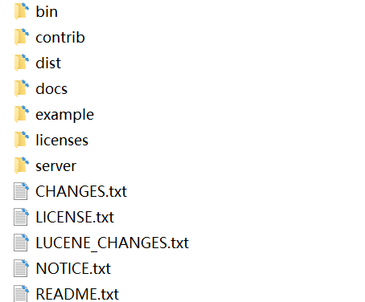

  ​	`bin`：官方提供的一些solr的运行脚本。

  ​    `contrib`：社区的一些贡献软件/插件，用于增强solr的功能。

  ​	`dist`：Solr的核心JAR包和扩展JAR包

  ​	`docs`：solr的API文档

  ​	`example`：官方提供的一些solr的demo代码

  ​    `licenses`：solr遵守的一些开源协议文件

  ​	`server`:一个jetty.官方为了方便部署Solr，在安装包中内置了一个Jetty; 可以利用内置的jetty部署solr;

  ​	`server/solr-webapp/webapp`:进入到sever目录中有一个webapp的目录，这个目录下部署的就是solr的war包(solr的服务);

  **可以先使用内置jetty服务器，部署solr服务**；

  ​	进入bin目录

  ​	启动命令：solr start  

  ​	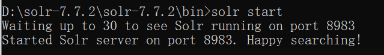

  ​    关闭命令：solr stop -all

  ​	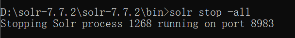

  ​    重启solr  ：solr restart –p p_num

  ​    **`使用localhost:8983就可以访问solr后台管理系统`**

  ### 部署solr到tomcat；

  ​	1.解压一个新的tomcat

  ​	2.将安装包下server/solr-webapp/webapp下的solr服务打war包；

  ​		进入server/solr-webapp/webapp目录

  ​		使用cmd窗口

  ​		jar cvf  solr.war ./*

  ​	3.将solr.war复制到tomcat/webapps目录中；

  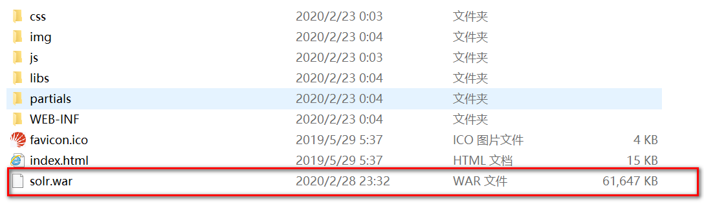

  4.启动tomcat，解压war包；

  5.修改webapp/solr/WEB-INF/web.xml的配置solr_home的位置；

  ```
  <env-entry>
     	<env-entry-name>solr/home</env-entry-name>
     	<env-entry-value>“你的solrhome位置”</env-entry-value>
     	<env-entry-type>java.lang.String</env-entry-type>
   </env-entry>
  ```

  Solr home目录，SolrHome是Solr运行的主目录，将来solr产生的数据就存储在SolrHOME中；

  SolrHOME可以含多个SolrCore；

  SolrCore即Solr实例每个SolrCore可以对外单独提供全文检索的服务.

  6.取消安全配置

  ```
  <!--
    <security-constraint>
    <web-resource-collection>
        <web-resource-name>Disable TRACE</web-resource-name>
      <url-pattern>/</url-pattern>
        <http-method>TRACE</http-method>
      </web-resource-collection>
      <auth-constraint/>
    </security-constraint>
    <security-constraint>
      <web-resource-collection>
        <web-resource-name>Enable everything but TRACE</web-resource-name>
        <url-pattern>/</url-pattern>
        <http-method-omission>TRACE</http-method-omission>
      </web-resource-collection>
    </security-constraint>-->
  ```

  7.将solr-7.7.2/server/solr中所有的文件复制到solrHome

  8.拷贝日志工具相关jar包：将solr-7.7.2/server/lib/ext下的jar包拷贝至上面Tomcat下Solr的/WEB-INF/lib/目录下

  9.拷贝metrics相关jar包：将solr-7.7.2/server/lib下metrics相关jar包也拷贝至/WEB-INF/lib/目录下

  10.拷贝dataimport相关jar包:solr-7.7.2/dist下dataimport相关jar包也拷贝至/WEB-INF/lib/目录下

  11.拷贝log4j2配置文件：将solr-7.7.2/server/resources目录中的log4j配置文件拷入web工程目录WEB-INF/classes（自行创建目录） ，并且修改日志文件的路径

  12.重启tomcat，看到welcome,说明solr就安装完毕

  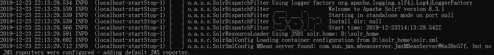

  13.访问后台管理系统进行测试

  http://localhost:8080/solr/index.html

  14.在tomcat的bin\catalina.bat中配置日志文件的环境参数

  ```javascript
  set "JAVA_OPTS=%JAVA_OPTS% -Dsolr.log.dir=C:\webapps\fooFts\logs"
  ```

  

### Linux下安装Solr

​		将solr安装到linux服务器中,可以使用虚拟机来模拟一个Linux服务器安装solr；

​	环境：

- ​			Cent0S 7.0 linux系统

- ​			 Jdk1.8  linux安装包  

- ​		    tomcat：tomcat8.5      

- ​            solr7.x 安装包(.tgz)

​	将linux中相关的安装包上传到linux，sftp上传；

​	**1.安装jdk**	

​	**2.解压jdk**

```
tar -xzvf jdk18 -C /usr/local
```


​	**3.配置环境变量**

```
vi /etc/profile
export JAVA_HOME=/usr/local/jdk1.8.0_171
export PATH=$JAVA_HOME/bin:$PATH
```

​	**4.重新加载profile文件,让配置文件生效**


​	**5.测试**

​	java -version

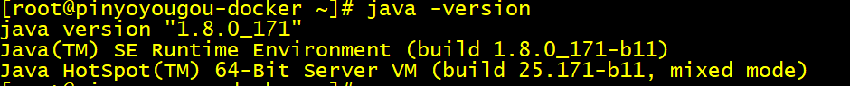


**安装tomcat,只需要解压即可**


安装solr,安装solr的过程和windows系统过程完全相同。只不过通过linux命令来操作而已；

1. 解压solr安装包,直接解压在目录即可；

    解压的目录结构和window版的目录结构相同；

2. 将server/solr-webapp/webapp下的solr服务打war包；

   2.1进入到webapp目录

   cd server/solr-webapp/webapp

   2.2 将webapp中的代码打成war包

    jar -cvf  solr.war ./*			    

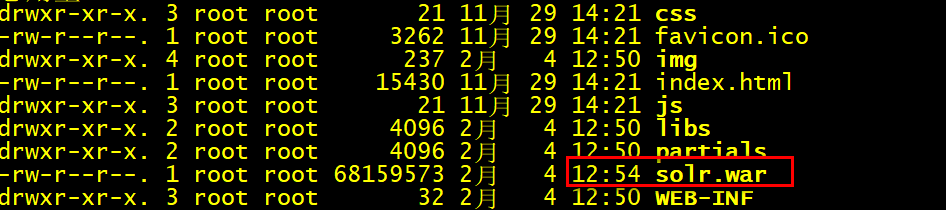

  3.将war包部署到tomcat的webapps目录


  4.启动tomcat，解压solr.war

​		4.1进入到tomcat的bin目录

​			cd /usr/local/apache-tomcat-8.5.50

​		4.2 启动tomcat

​				

​		4.3 进入到webapp目录中查看		

5. 修改webapp/solr/WEB-INF/web.xml的配置solrhome的位置；

   ```
   <env-entry>
      	<env-entry-name>solr/home</env-entry-name>
   	<env-entry-value>“你的solrhome位置”</env-entry-value>
      	<env-entry-type>java.lang.String</env-entry-type>
    </env-entry>
   ```
   
   既然solrhome指定的位置在/user/local/solr_home下面；所以需要创建一个solr_home的文件夹；
   
   

   6.取消安全配置（和window相同）

   7.将solr-7.7.2/server/solr中所有的文件复制到solrHome

​		7.1进入到solr-7.7.2/server/solr


​	 	7.2将所有的文件复制到solrHome

​		

8.拷贝日志工具相关jar包：将solr-7.7.2/server/lib/ext下的jar包拷贝至上面Tomcat下Solr的/WEB-INF/lib/目录下

​		8.1 进入solr-7.7.2/server/lib/ext

```
	cd solr-7.7.2/server/lib/ext
```

   	8.2 将所有文件复制到Tomcat下Solr的/WEB-INF/lib/


9.拷贝 metrics相关jar包：将solr-7.7.2/server/lib下metrics相关jar包也拷贝至/WEB-INF/lib/目录下

​		9.1 进入solr-7.7.2/server/lib	

```
cd solr-7.7.2/server/lib
```


   9.2 将metrics-开始的所有文件复制到Tomcat下Solr的/WEB-INF/lib/


10. 将solr安装包中dist目录中和数据导入相关的2个包，复制到tomcat/webapps/solr/WEB-INF/lib

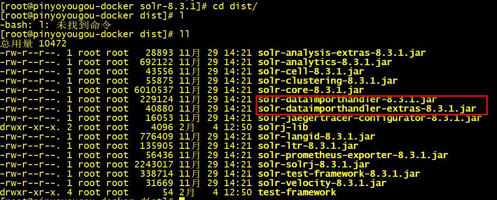

```
 cp solr-dataimporthandler-* /usr/local/apache-tomcat-8.5.50/webapps/solr/WEB-INF/lib/
```

11.拷贝log4j2配置文件：将solr-7.7.2/server/resource目录中的log4j配置文件拷入web工程目录WEB-INF/classes（自行创建目录） ，并且修改日志文件的路径

```
修改日志文件的路径
JAVA_OPTS="$JAVA_OPTS -Dsolr.log.dir=/usr/local/apache-tomcat-8.5.50/webapps/solr/logs"
```

​	11.1 进入到solr-7.7.2/server/resource目录中

```
cd solr-7.7.2/server/resource
```

​		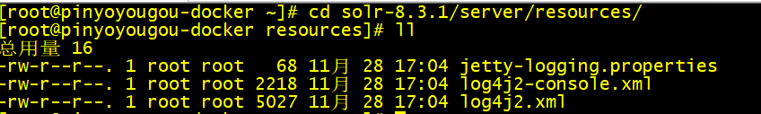

​	11.2  将log4j2的配置文件复制到solr 的WEB-INF/classes目录；

​			创建classes目录

​			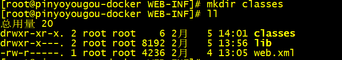

​			log4j的文件复制；

​			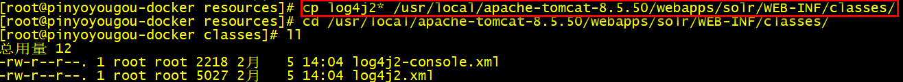

12.重启tomcat

​		进入到日志文件中查看启动情况；

```
cd ../logs

more catalina.out
```

13.访问后台管理系统进行测试

http://192.168.200.129:8080/solr/index.html

### SolrCore

​		solr部署启动成功之后，需要创建core才可以使用的，才可以使用Solr；类似于我们安装完毕MySQL以后，需要创建数据库一样；

### 什么是SolrCore

​	在Solr中、每一个Core、代表一个索引库、里面包含索引数据及其配置信息。

​    Solr中可以拥有多个Core、也就是可以同时管理多个索引库、就像mysql中可以有多个数据库一样。

​    所以SolrCore可以理解成MySQL中的数据库；

### SolrCore维护（windows）

1.SolrCore目录结构

​    Core中有二个重要目录：conf和data

​    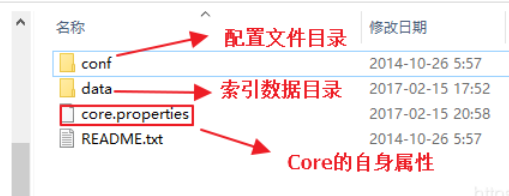

- ​    `conf`:存储SolrCore相关的配置文件；


- ​    `data`:SolrCore的索引数据；


- ​    `core.properties`：SolrCore的名称,name=SolrCore名称；


​	搭建一个SolrCore只需要创建 2个目录和一个properties文件即可； 

2.SolrHome中搭建SolrCore

​		2.1一个solr_home是由多个solrCore构成，所以solrCore是搭建在solrHome中；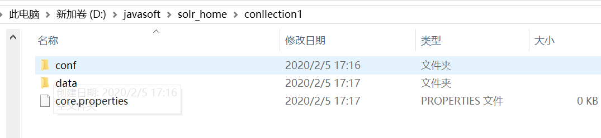

​		2.2将solr安装包中的配置文件复制到conf目录；

​		搭建好solrCore以后，conf目录还没没有配置文件，需要将solr安装包中提供的示例配置文件复制到conf目录 

​         solr安装包中配置文件的位置：solr-7.7.2\example\example-DIH\solr\solr\conf

​		2.3 重启solr

​		2.4 在solr的管理后台来查看

​		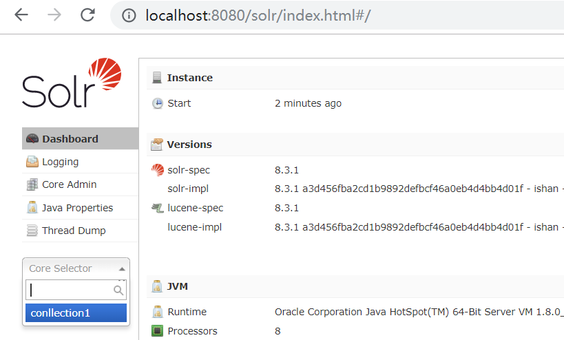

3.创建多个solrCore；

​	只要复制SolrCore一份，重启solr；

​    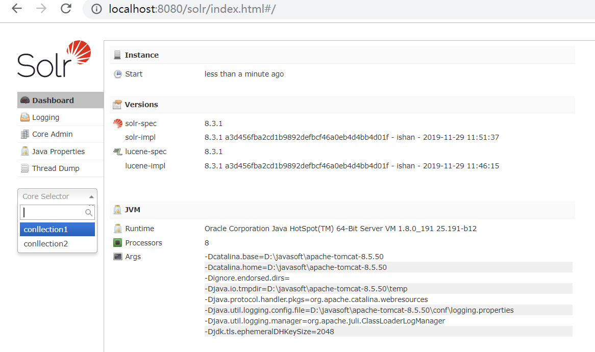


